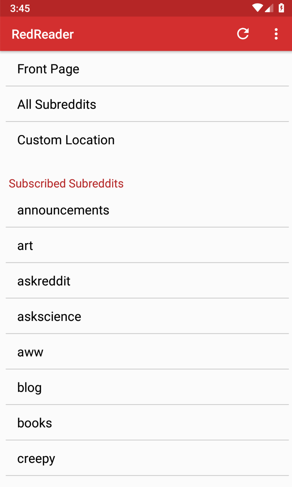

# RedReader 
#### [GitHub link](https://github.com/QuantumBadger/RedReader) | [Google Play store link](https://play.google.com/store/apps/details?id=org.quantumbadger.redreader)
### _My proposed contribution_: a 'SAVE' button implementation for subreddits

## Project Abstract
RedReader is a free, zero ad, open source Android client for reddit. It is robust with features, while also maintaining a lightweight footprint. The application itself is built using Gradle.

  

## Project Relevance
RedReader is a large, open-source project that has been worked on by over 90 contributors on GitHub. Overall, there has been over 1,200 commits to the repo. Because this project is so large in scale, I believe it aligns with the core goals of Software Design: to perform tasks such as project management, version control, build, test, and issue tracking.

## Conceptual Design
While playing around with RedReader in my Android environment, I noticed that the ability to subscribe to a subreddit is a tad cumbersome. In order to subscribe to a subreddit (once signed in to your reddit account), you must visit a subreddit you are not yet subscribed to by tapping the 'Custom Location' text in the main menu and typing in the subreddit's name. Then you have to tap the three dots in the top right corner to expose a drop down menu, then tap the 'Subscribe' text. 
### This process currently takes four user interactions. My conceptual design would halve the number of required user interactions to subscribe to a subreddit.
In order to achieve this reduction in interactions, I will implement a subscribe button that a user can tap immediately after entering the subreddit's name in the 'Custom Location' view.

  

## Use Case

  

The user will interact with the 'Subscribe' button. Upon being touched, the app will send the user input to the API. The API will allow the app to communicate directly with reddit's servers, allowing the user to add the specified subreddit to their subscriptions.

## Background
_<https://github.com/QuantumBadger/RedReader>_

